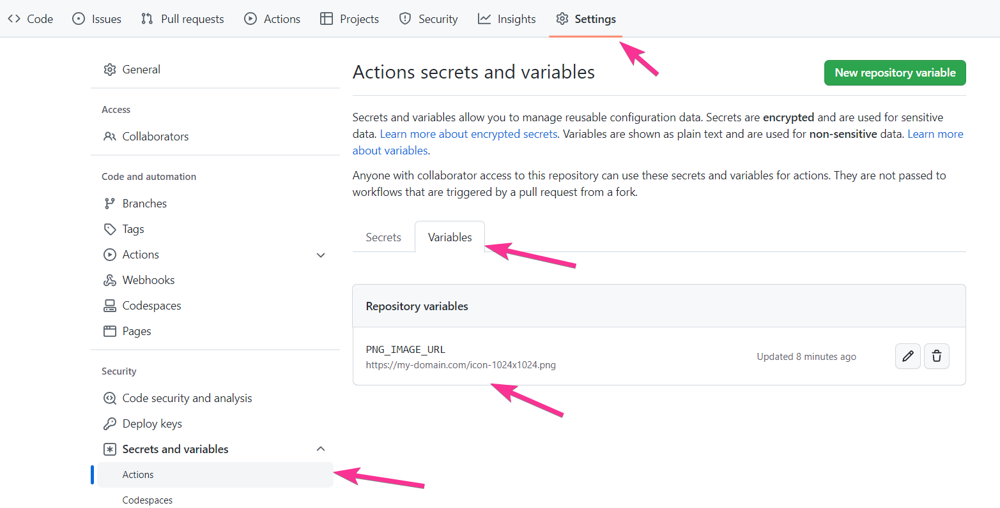
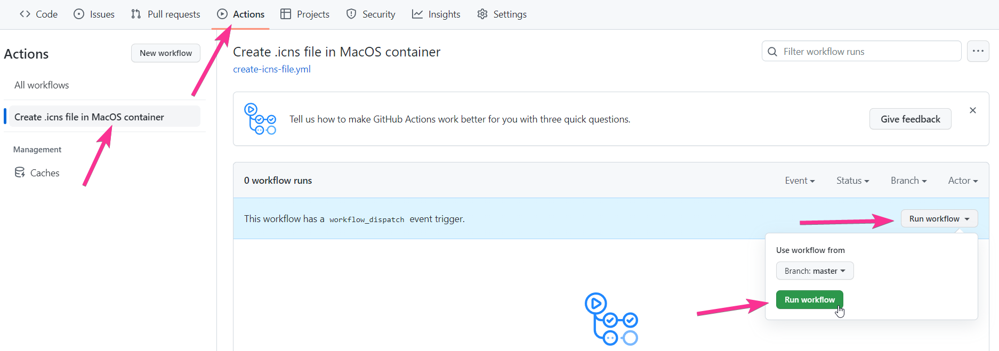
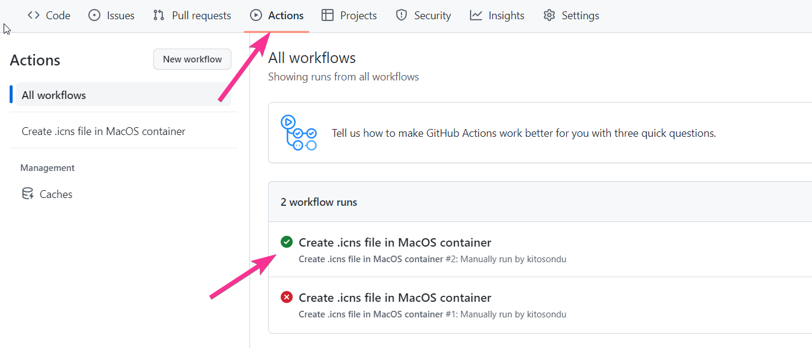
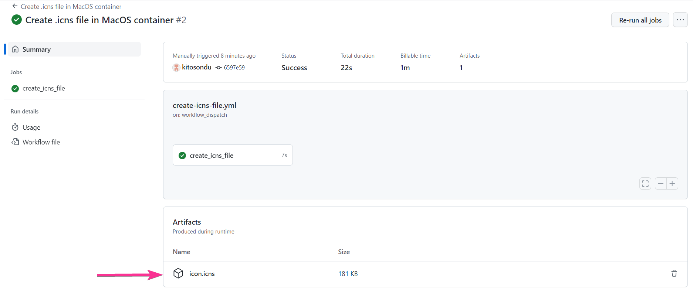

# Create .ICNS file from .PNG image using URL

This is a simple instrument for creating .icns file from PNG for someone who does not have access to MacOS.

1. Save URL of the .png file into 'Actions secrets and variables' as a `PNG_IMAGE_URL` variable. The image size must be 1024 x 1024 px.

2. Run `create-icns-file` pipeline manually

3. Download `icon.icns` file from GitHub cache.

